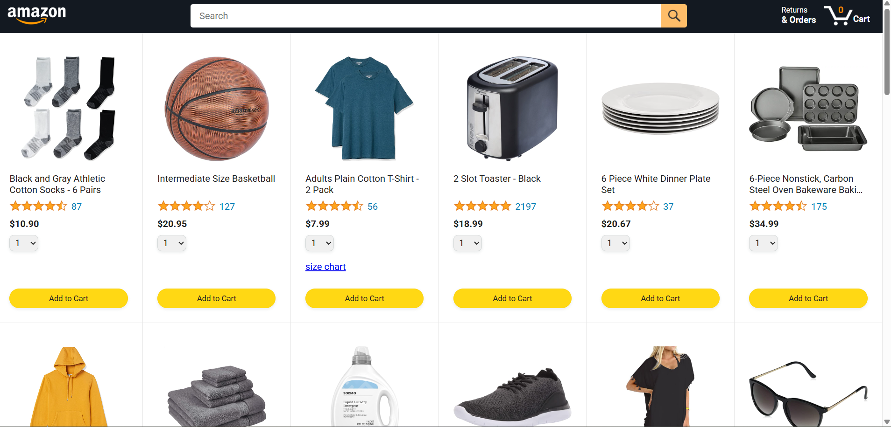
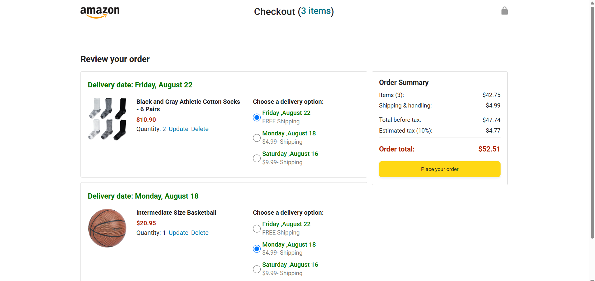

# 🛒 Amazon Clone

A responsive front-end clone of Amazon’s UI and core flows, built with HTML, CSS, and JavaScript.

## 📍 Live Demo
➡️ **[Click here to view](https://rohini19-coder.github.io/amazon-clone/)**

## 📸 Preview

**Homepage**

**Cart Page**

## 📂 Features
- Responsive layout (desktop & mobile)
- Product listing grid
- Shopping cart with quantity badge
- Orders & tracking pages
- Simple checkout flow

## 🛠 Technologies
- **HTML5**
- **CSS3**
- **JavaScript (ES6 modules)**

## 🗂️ Project Structure
